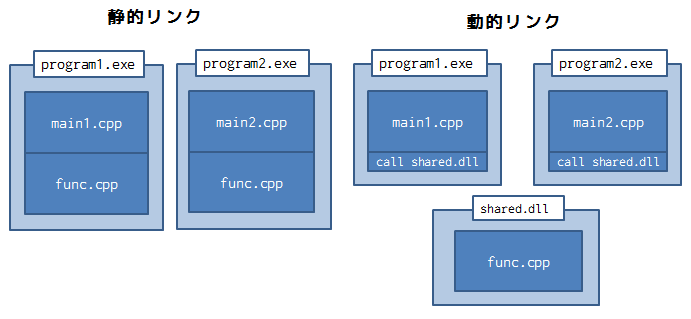

class: center, middle

# Windowsの使い方基礎編 via COM and .NET Framework

---

class: center, middle

## コンパイラのおさらい

---
### 要約

---

### (C++)コンパイラで実行ファイルを作るまで
1. いわゆるコンパイル(コンパイラの仕事)
    * `.cpp`, `.h`, `.hpp`などのソースファイルからファイル単位でコードを機械語に翻訳
    * `.o`のオブジェクトファイルと言われるファイルを生成
```shell
g++ -c hoge.cpp fuga.cpp main.cpp
```
2. いわゆる（静的）リンク(リンカの仕事)
    * 機械語に翻訳されたオブジェクトファイルを繋ぎ合わせて1つの実行ファイルを作る
```shell
g++ hoge.o fuga.o main.o
```

### Note
別々のファイルに記述されたコードもリンカによって1つの実行ファイルに繋ぎ合わされる。
リンカによって別のファイルの関数やクラスなどを見つけることが可能。

---

### もう少しコンパイルの仕組み(1/4)

ソースコード(main.cpp)
```cpp
#include <iostream>
#include <cmath>

int main(int argc, char const* argv[])
{
    std::cout << "Hello 世界" << std::endl;
    std::cout << std::exp(1.0) << std::endl;
    return 0;
}
```

1. プリプロセッサが`main.cpp`を解析し、includeやマクロを展開する。
2. コンパイラが展開されたソースファイルを解析し、アセンブリコードに変換
3. アセンブラがアセンブリコードからオブジェクトファイルを生成
4. リンカがオブジェクトファイルを静的リンクして実行ファイルを生成

---

### もう少しコンパイルの仕組み(2/4)

プリプロセッサが`main.cpp`を解析し、includeやマクロを展開する。
```shell
cpp -E main.cpp -o main.ii
```

main.ii(2万行くらい)
```ii
# 1 "<built-in>"
# 1 "<command-line>"
# 1 "main.cpp"
# 1 "C:/MinGW64/mingw64/x86_64-w64-mingw32/include/c++/iostream" 1 3
# 36 "C:/MinGW64/mingw64/x86_64-w64-mingw32/include/c++/iostream" 3
       
# 37 "C:/MinGW64/mingw64/x86_64-w64-mingw32/include/c++/iostream" 3
  .
  .
# 4 "main.cpp"
int main(int argc, char const* argv[])
{
    std::cout << "Hello 世界" << std::endl;
    std::cout << std::exp(1.0) << std::endl;
    return 0;
}
```

---

### もう少しコンパイルの仕組み(3/4)

コンパイラが展開されたソースファイルを解析し、アセンブリコードに変換
```shell
cc1plus -S main.cpp -o main.s
```
出力
```asm
	.file	"main.cpp"
.lcomm _ZStL8__ioinit,1,1
	.def	__main;	.scl	2;	.type	32;	.endef
	.section .rdata,"dr"
.LC0:
	.ascii "Hello \344\270\226\347\225\214\0"
.
.
	.linkonce	discard
.refptr._ZSt4endlIcSt11char_traitsIcEERSt13basic_ostreamIT_T0_ES6_:
	.quad	_ZSt4endlIcSt11char_traitsIcEERSt13basic_ostreamIT_T0_ES6_
	.section	.rdata$.refptr._ZSt4cout, "dr"
	.globl	.refptr._ZSt4cout
	.linkonce	discard
.refptr._ZSt4cout:
	.quad	_ZSt4cout
```

---

### もう少しコンパイルの仕組み(4/4)
アセンブラがアセンブリコードからオブジェクトファイルを生成
```shell
as -c main.s -o main.o
```

オブジェクトファイルに登録されているシンボル情報(`nm`コマンドの出力結果)
```shell
$ nm main.o
0000000000000000 b .bss
.
                 U _ZSt4endlIcSt11char_traitsIcEERSt13basic_ostreamIT_T0_ES6_
0000000000000000 b _ZStL8__ioinit
                 U _ZStlsISt11char_traitsIcEERSt13basic_ostreamIcT_ES5_PKc
                 U atexit
0000000000000000 T main
```

```shell
$ nm -C main.o
0000000000000000 b .bss
.
                 U std::basic_ostream<char, std::char_traits<char> >& std::endl<char, std::char_traits<char> >(std::basic_ostream<char, std::char_traits<char> >&)
0000000000000000 b std::__ioinit
                 U std::basic_ostream<char, std::char_traits<char> >& std::operator<< <std::char_traits<char> >(std::basic_ostream<char, std::char_traits<char> >&, char const*)
                 U atexit
0000000000000000 T main
```

---

## 静的/動的リンク
* 静的リンク
    * オブジェクトファイル(`.o`)の**コンパイル時**のリンク
    * 要は`.o`ファイルをくっつけて1つの実行ファイルにする
    * 全ての実行ファイルの中に必要なコードが含まれる
* 動的リンク
    * 動的リンクライブラリ(`.so`, `.dll`)の**実行時**のリンク
    * 実行時に外部dllから必要なコードをロードする。
    * 実行ファイル自身にライブラリのコードは含まれない

.center[]

---

## 静的/動的リンクの良し悪し
一般的には
* 動的リンク良し
    1. コンパイル時の依存関係が不要
    1. ライブラリの利用/アップデートにコンパイルが不要
    1. 実行ファイルが静的リンクより小さくなる場合がある
    1. 実行時のメモリ使用量が静的リンクより小さく場合がある
* 動的リンク悪し
    1. 実行時の依存関係がある（dllが必要）
        * 使用するdllが使用するdllが使用するdllが...必要
    1. dll地獄
        * dllに非互換の変更があった場合に利用者側で変更を検知できない
        * dllにversion名が付与されるのはこの為(`msvcr71.dll`など)
    1. 静的リンクより遅い場合がある

静的リンクは動的リンクの良し悪しの逆なので略。

パフォーマンスを気にしなければ、ライブラリの利用者の観点からは動的リンクの方がうれしい。

**動的リンクのデメリットを排除できればうれしい**

---

class: center, middle

## プログラミングに関するおさらい

---
### 要約

---

### オブジェクト指向モデリング(Object-Oriented Modeling)
OOMとは？
* プログラムをオブジェクト(クラス)と言われる単位で構成
* オブジェクト間のデータのやり取りで処理を表現
* 要はクラスとクラスのメソッドを使ってプログラムを書くということ
    * OOM以前は関数を使ってプログラムを書くだけ(関数型プログラミング)

動機（の1つ)
* 関数型プログラミング（関数だけで構成されたプログラム）でプログラムを記述した場合、ソフトウェアの高度化に伴ってコードも複雑化し、実装コストが増え続ける。
実装コストを下げる為には、**コードの再利用**が重要。

コードの再利用という観点でみると
* OOM
    * オブジェクト（クラス）の集まりを再利用する
* 関数型プログラミング
    * 関数の集まりをモジュールとして再利用する

OOMの方が人間の直観にあっているという研究もあるらしい

---

## C++
* C++はオブジェクト指向プログラミング可能な言語。
* OOMの最初期言語。smalltalkの次くらい。1983年公開。
* C++は手続き型言語とオブジェクト指向プログラミングが合わさった(少なくとも当時の中では)利用しやすい言語
* **C++は標準規格が定まるのが遅かった(1998年)のでC++のリファレンスを基にしたコンパイラがたくさん作られた**

みんなが好き勝手作ったので言語仕様とコンパイラの実装が乖離していた（いる）
* 最近の言語は言語開発者が言語仕様と一緒に処理系を提供する
* 現在は、GNU gcc, Visual C++ compiler, clangがメジャーなコンパイラ

####コンパイラがいっぱいあるとライブラリ(dll)を作る際に困る

dllはコンパイラに依存する!

---

### dllのコンパイラ依存(1/5)
dllのコンパイラ依存性を説明する為に以下の例を取り上げる。例は[3]による。

次のコードから、`FastString.dll`を作ることを考える。
```cpp
class __declspec(dllexport) FastString { 
    char *_pString;
public:
    FastString();                        // constructor
    ~FastString();                       // destructor
    int length() const;                  // member function
    int find(const char *pString) const; // member function
};
```
* このクラスは文字列を扱うクラスで、高速な`find`メソッドによって文字列検索を行うことができる。
* `__declspec(dllexport)`はクラスをdllにexportする為のオマジナイ。

`FastString.dll`を使うユーザは理想的には以下の恩恵をうける。
* `find`メソッドのアルゴリズムが改良された時dllの差し替えで改良された`FastString`クラスが使える
* `FastString`クラスを使うプログラムが複数あった場合に、メモリとディスクの節約になる

---

### dllのコンパイラ依存(2/5)
現実的な問題としてC++には生成するバイナリレベルの標準がない
* 文法と文法の意味はISOによって標準化されているが、生成するバイナリに規定はない

つまり、コンパイラが生成するバイナリについてはコンパイラの実装に任せられている。具体的には
* リンク時の問題
    * シンボル名(変数、関数、クラス名などの)のマングリング方式の違い
* 生成コード(オブジェクトファイル）の非互換性
    * クラスのインターフェースが不変であってもdllは非互換
    * VisualC++でコンパイルされたプログラムの例外は、Watcomコンパイラでコンパイルされたプログラムは検知できない

---

### dllのコンパイラ依存(3/5)
**シンボル名のマングリング方式の違い**

C++にはオーバーロードがある。つまり、
* オーバーロードされた関数名の識別の為に、個々の関数に一意な修飾子を付与（マングリング）する必要がある。
* C++の言語仕様上オーバーロードは必須だが、修飾子に規定はない。個々のコンパイラの実装による
* 修飾子名は、CPUや地理情報、コンパイル時刻などに依存し得る

具体的には次の場合問題となる。
1. Aコンパイラで関数`void hoge()`を含む`hoge.dll`を作る
    * Aのマングリングによって`_ZhogeA`とかいう名前になる
2. Bコンパイラと`void hoge()`を呼ぶ`main.cpp`を記載し、プログラム`main.exe`を生成
    * Bのマングリングは`_ZhogeB`とかいう名前になる
    * Bは`hoge.dll`を調べるが`_ZhogeB`は見つからない

---

### dllのコンパイラ依存(4/5)
**クラスのインターフェースが不変でも生成されるバイナリは非互換**

`FastString.dll`の例を考える。
文字数を数える`length`メソッドの高速化の為に、コンストラクタで文字数をキャッシュするように変更したとする。
便宜的に変更前をv1とし、変更後をv2と呼ぶ
```cpp
class __declspec(dllexport) FastString { 
    std::size_t _stringLength;
    char *_pString;                      // add
public:
    FastString();                        // constructor
    ~FastString();                       // destructor
    int length() const;                  // member function
    int find(const char *pString) const; // member function
};
```
* `FastString`クラスのインターフェース(publicなメソッド、変数)は変わっていない
* `FastString`v1を利用していたソースコードに変更は必要なく`FastString`v2へ変更できる

####実際は`FastString`v1で動いていたプログラムがv2で動く保証はない

---
### dllのコンパイラ依存(5/5)
**クラスのインターフェースが不変でも生成されるバイナリは非互換**
例えば以下のようなケースで問題が起こる。
* v1では`FastString`クラスは4バイトのインスタンス
* v2では`FastString`クラスは8バイトのインスタンス
生成された`FastString.dll`は
* v1ではコンストラクタが4バイトのメモリを確保する
* v2ではコンストラクタが8バイトのメモリを確保する

####v1を使用していたアプリケーションは4バイトであることを前提としたコードが生成されている！
つまり、再コンパイルすることなしにはv2への`dll`の変更はできない

---

class: center, middle

## Component Object Model(COM)

---
### 要約


---

### Component Object Model(COM)
* COMはWindowsが提案したオブジェクトの再利用のためのプログラミングモデル。
* COMはCOMコンポーネントを作成する為のプログラミングの枠組み。
* COMの使用に則ったプログラムを書くことで再利用を促進する

### COMの歴史
* COMの前身は1990年Object Linking and Embedding(OLE 1.0) 
    * OLEはアプリケーション(ExcelやWord)などをオブジェクトとして操作する為の仕組み
* OLE1.0がすごい不評だったので、1997年にCOMを用いてOLE2.0がリリースされた

### COMが作られた背景
今まで見たようにC++で**簡単に**再利用できるプログラムをかくのは難しかった。
COMの動機は主に2つ
* インターフェースの変更がなければdllの差し替えのみでライブラリを変更したい。
* 言語に依存しない形でdllの生成を行いたい

---

### dllの再利用(1/3)
COMはコンパイラに以下の仮定をおくことで、dllを再利用するフレームワークを作った。

**COMの仮定**

コンパイラが生成するバイナリに以下の仮定を置く
1. C言語スタイルの構造体はコンパイラによる差がない
    * C言語では構造体のメモリ配置が既定されているので、C++でそれをあえて変える意味はない
2. 全てのコンパイラで関数引数を同じ順番で渡し、スタックが同じ方法でクリーンアップされる
    * 条件コンパイルやコンパイラディレクティブで対応可能
3. 特定のプラットフォーム上では、仮想関数呼び出しのメカニズムはコンパイラによる差がない
    * WIN32系はアジャスタサンク
    * その他はCFRONTスタイルの仮想関数テーブル

**Note**

上記の仮定は1990年代のコンパイラで一般的と思われる仮定。
現在は必ずしも上記を仮定できるわけではない。特にclang。

---

### dllの再利用(2/3)
まずは、実装とインターフェースの分離を下記のように行う
* インターフェースは純粋仮想関数として公開する
* 実装は公開せず、dllに含める

```cpp
class __declspec(dllexport) IFastString { 
public:
    virtual int length() const = 0;                  // member function
    virtual int find(const char *pString) const = 0; // member function
};
```

```cpp
class FastString : public IFastString { 
    std::size_t _stringLength;
    char *_pString;                      // add
public:
    FastString();                        // constructor
    ~FastString();                       // destructor
    int length() const;                  // member function
    int find(const char *pString) const; // member function
};
```

---
### dllの再利用(3/3)

実装とインタフェースの分離により実装がかわってもdllの差し替えのみですむようになる。
残るリンク時のシンボルの問題は、以下で回避可能
* インスタンスの生成を生成関数で行う
* `extern`キーワードを生成関数につける(`extern`でマングルを無効化できる）

```cpp
// pString is arguments of constructor of FastString
extern IFastString* createFastString(const char* pString);
```

---
### COMの言語非依存性
以上の方法によってコンパイラに依存しない`dll`が作成可能になるが、C++言語への依存という問題が残る。

COMでは言語に依存せずにインターフェースを定義できるようにInterface Definition Laguage(IDL)を提供している。

IDLを用いて以下の方法で言語によらないdllを提供する。

* IDLでインターフェースを定義
    * IDLから対象の言語(C++, Java, VBなど）のインターフェース情報を生成する
* 対象の言語で機能を実装する

---

class: center, middle

## .Net Framework

---

### .Net Frameworkの背景

COMはインターフェースと実装を分離し、バイナリレベルでのオブジェクト指向を実現した。
つまり、
* インターフェースを経由してライブラリにアクセス
* 生成されたライブラリは言語非依存で同じ動作をする

COMで重要であったのは
1. オブジェクト指向言語としてインターフェースと実装を分離すること
2. バイナリレベルで再利用可能なライブラリを提供する

1はオブジェクト指向言語であればインターフェースと実装を提供できる。
2について、.Net framworkでは以下の方法で問題への解決策を提供する。
* 対象の言語を中間言語(IL)に変換
* 中間言語をJITコンパイラで実行時に機械語に変換

Javaと同じ仕組みであることに注意。

---
### .Net Framework
.Net Framewokrは次の4つが重要な役割を果たす
* Intermediate Languate(IL)
    * COMの中間言語と同じ中間言語
* Common Language Infrastructure(CLI)
    * 共通言語基盤。
    * 言語に依存しない実行環境や実行コードに関する仕様を定めたもの
* Commono Lnaguage Specifications(CLS)
    * 共通言語仕様
    * CLIが提供すべき言語機能で、仕様自体がCLIの一部
* Common Language Runtime(CLR)
    * CLIのMicrosoft上の実装実装。.Net FrameworkはCLR上で動作する。
    * MonoはオープンソースのCLIの実装

**C#**

C#はCLIを想定して作られた言語。
CLIは言語に依存しない仕組みだが、既存の言語はCLIを想定して作られていないのでCLSとの乖離がある。
新しく言語を作ることでCLSと親和性の高い言語を作ることが可能。
* C#もCLSに完全に準拠はしていないことに注意

---
### CLR via other languages
C#以外にCLR上で動作する言語は以下のようなものがある。
* VB.Net
    * VBの後継
* C++/CLI
    * C++のCLIへの拡張
* Iron Python
    * 動的型付言語による最初の実装
    * 2015年から更新がとまってる
* Iron Ruby
    * Iron Pythonの後発
    * 一生更新されない
* IL
    * ILも一つの言語なので、ILを直書きもできる
* JScript.Net
    * ごみ

.Netのプログラムとしては同じプログラムがかける。
どれを使うかは各言語の特徴を考慮してきめる。

---

##参考文献
* Windows
    * [1][Windows Internals, part 1](http://www.amazon.co.jp/Windows-Internals-Part-Developer-Reference/dp/0735648735)
    * [1][Windows Internals, part 2](http://www.amazon.co.jp/Windows-Internals-Part-Developer-Reference/dp/0735665877/ref=pd_bxgy_14_img_2?ie=UTF8&refRID=0BS169F308BQVHDD96R1)
    * [2][Inside Windows 上(邦訳)](http://www.amazon.co.jp/%E3%82%A4%E3%83%B3%E3%82%B5%E3%82%A4%E3%83%89WINDOWS-%E7%AC%AC6%E7%89%88-%E4%B8%8A-Microsoft-Press/dp/4822294706)
    * [2][Inside Windows 下(邦訳)](http://www.amazon.co.jp/dp/4822294714/ref=pd_lpo_sbs_dp_ss_1?pf_rd_p=187205609&pf_rd_s=lpo-top-stripe&pf_rd_t=201&pf_rd_i=4822294706&pf_rd_m=AN1VRQENFRJN5&pf_rd_r=1NY7PCVZYNP7YZ2J2MXJ)
* COM
    * [3][Essential COM(邦訳)](http://www.amazon.co.jp/Essential-ASCII-Addison-Wesley-Programming/dp/4756130666)
* .NET Framework
    * [4][.NET Framework -CLR via C#-](http://www.amazon.co.jp/%E3%83%97%E3%83%AD%E3%82%B0%E3%83%A9%E3%83%9F%E3%83%B3%E3%82%B0-NET-Framework-%E7%AC%AC4%E7%89%88-Microsoft-Press/dp/4822294951)

* 
[](https://www.microsoft.com/japan/msdn/vs_previous/visualc/techmat/feature/jangrayhood/)

