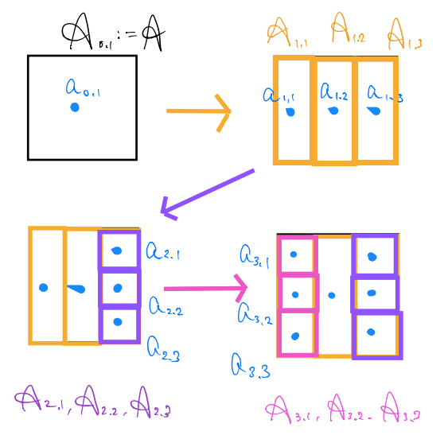
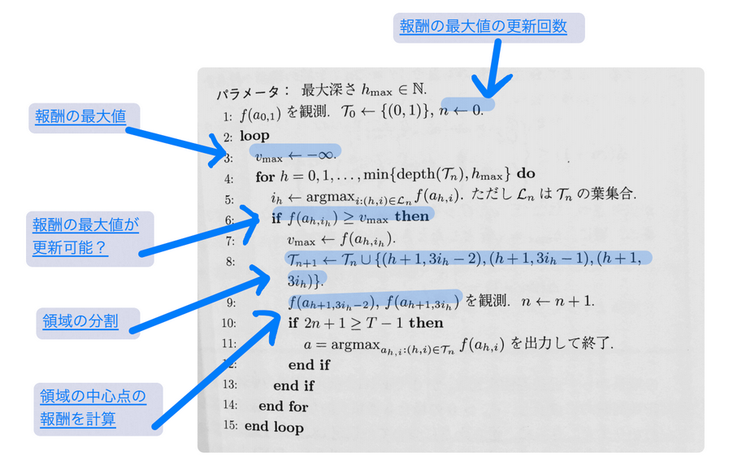

class: center, middle

# バンディット問題の理論とアルゴリズム
## Chapter 8. 連続腕バンディットとベイズ最適化

---

### 概要

* Chap8まで
    * 有限個$K$のスロット（選択肢）
    * 時刻$t$で、スロット$i$を選ぶと報酬$X_{i}(t)$
    * $T$までの報酬の和を最大化する

* 特に線形バンディット(Chap7)では
    * 有限個$K$のスロット（選択肢）
    * 時刻$t$で、スロット$i$を選ぶと報酬$X_{i}(t)$
    * 報酬$X\_{i}(t) = a\_{i}(t)^{\mathrm{T}} \theta + \epsilon(t)$
        * 報酬が線形な形でかける場合を考えた
    * $T$までの報酬の和を最大化する

* Chap8では
    * 選択肢が（非可算）無限個$\mathcal{A} \subset \mathbb{R}^{d}$
    * 時刻$t$で、選択肢$a\_{t}$を選ぶと報酬$f\_(a\_{t})$得られる
    * $T$までの報酬の和を最大化する

---

### 問題の単純な例(離散バンディット)
* $\mathcal{A}$を位置として考える
* 離散の場合は$K=4$箇所にセンサや自動販売機などがおける
* 時刻$t$で位置$i(t)$に対して何らかの報酬$X_{i(t)}(t)$が得られる
* 位置を替えて報酬$X_{i(t)}(t)$を最大化

.center[]

---

### 問題の単純な例(連続バンディット)
* 連続の場合は直線上の好きな位置にセンサや自動販売機などがおける
* 時刻$t$で位置$a\_{t}$に対して何らかの報酬$f(a\_{t})$が得られる
* 位置を替えて報酬の和を$\sum\_{s=1}^{T}f(a\_{s})$を最大化

.center[]

---

### その他の例

* あるモデルのHyper parameterの$\theta \in \Theta = \mathcal{A}$を考える
    * 正規分布の
* 時刻$t$でhyper parameterを1つ選択$\theta\_{t} \in \Theta$すると、訓練（学習）データに対する誤差（報酬の負値）$-f(\theta\_{t})$が得られる
* 誤差の和を最小（報酬を最大）にするように、$\theta\_{1}, \ldots, \theta\_{T}$を選ぶ

---

### 連続腕バンディット問題の定式化
* 例から分かるように、選択肢が（非可算）無限個のバンディット
* （非可算）無限個の場合に、（期待）報酬が最大になるように選択肢を選びたい

以下のような問題を考える

* 選択肢$a \in \mathcal{A}$に対応した報酬$f(a)$が与えられる
* 時刻$t = 1, \ldots, T$で、選択肢$a\_{t} \in \mathcal{A}$を選び報酬$f(a\_{t})$を受け取る
* $T$での報酬が最大になるように、うまく選択肢を選ぶ

このとき、以下を満たす$(a\_{1}, \ldots, a\_{T}) \in \mathcal{A}^{T}$を見つける

$$
\arg\max\_{(a\_{1}, \ldots, a\_{T})} \sum\_{s=1}^{T} f(a\_{t})
$$

但し、時刻$t+1$での選択肢は時刻$1$から$s$までの選択肢$a\_{1}, \ldots, a\_{t}$を考慮して決めて良い

---

#### 連続腕バンディットとベイズ最適化(Baysian optimization)

* Brochu, E., Cora, V. M., & Nandode Freitas. (2010). A Tutorial on Bayesian Optimization of Expensive Cost Functions, with Application to Active User Modeling and Hierarchical Reinforcement Learning. arXiv, (arXiv:1012.2599), 49.
    * Baysian optimizationを理解する上では本を読むよりこっちを見た方が良い
    * Banditとの関係についても簡単に記載している
    * 連続腕バンディットの問題をBaysian optimizationの手法を適用する

ここからの議論の流れ
1. $f$を確率過程としてモデル化する
    * 連続腕の確率的バンディット
2. 時点$t$での選択肢の選び方(連続腕バンディット方策)について述べる
    * 各種のacquisition function

---

### 連続腕の確率的バンディット問題(1/3)
* 連続でない確率的バンディット問題では
	* 時刻$t$での選択肢$i(t) = \\{1, \ldots, K\\}$の報酬$X_{i(t)}(t)$は確率変数
* 連続腕バンディットでの確率的バンディット問題への
	* 自然な拡張として時刻$t$での選択肢$a \in$の報酬$f(a\_{t})$は確率変数とする
	* （非可算）無限個の確率変数の族$\\{f(a)\\}_{a \in \mathcal{A}}$が必要
		* 確率過程として報酬を考える

特に、確率過程としてガウス過程を考える

#### Def. ガウス過程(Gaussian Process)
$\mathcal{A}$を添え字集合とする。
$(f(a))\_{a \in \mathcal{A}}$を確率変数の族とする。
このとき、$\forall t \in \mathbb{N}$ について、$(f(a\_{1}), \ldots, f(a\_{t}))$ が$t$次元正規分布に従うとき、 $(f(a))_{a \in \mathcal{A}}$は、$\mathcal{A}$上のガウス過程であるという。

---

### 連続腕の確率的バンディット問題(2/3)
特に、連続腕バンディットでは、ガウス過程に以下の条件を仮定する。

$$
    (f(a\_{1}), \ldots, f(a\_{t}) )
        \sim \mathcal{N}^{t}(\mu(\mathbf{a}), \sigma(\mathbf{a}, \mathbf{a})),
    \\\\
    \forall \mathbf{a} := (a\_{1}, \ldots, a\_{t}) \in \mathcal{A}
$$

* 平均$\mu(\mathbf{a})$, 共分散行列$\sigma(\mathbf{a}, \mathbf{a})$の$t$次元ガウス分布に従う
* 平均と共分散行列は$a \in \mathcal{A}$の関数としてかける

$$
\begin{eqnarray}
    \mu(\mathbf{a})
        & := &
        \left(
            \begin{array}{c}
                \mu^{1}(a\_{1}) \\\\
                \mu^{2}(a\_{2}) \\\\
                \vdots \\\\
                \mu^{t}(a\_{t})
            \end{array}
        \right),
    \\\\
    \sigma(\mathbf{a}, \mathbf{a})
        & := &
        \left(
            \begin{array}{cccc}
                k(a\_{1}, a\_{1}) & k(a\_{1}, a\_{2}) & \ldots & k(a\_{1}, a\_{t}) \\\\
                k(a\_{2}, a\_{1}) & k(a\_{2}, a\_{2}) & \ldots & k(a\_{2}, a\_{t}) \\\\
                \vdots &  & \ddots & \vdots \\\\
                k(a\_{t}, a\_{1}) & k(a\_{t}, a\_{2}) & \ldots & k(a\_{t}, a\_{t})
            \end{array}
        \right)
\end{eqnarray}
$$

---

### 連続腕の確率的バンディット問題(2.5/3)
* 時刻$t$までの選択$\mathbf{a}\_{t}:=(a\_{1}, \ldots, a\_{t})$が時刻$t+1$で分かっているとすると
* $\mathbf{f}\_{t}(\mathbf{a}\_{t}) := (f(a\_{1}), \ldots, f(a\_{t}))$ が与えられた下での$f(a\_{t+1})$の条件付き確率$p\_{f(a\_{t+1}) \mid \mathbf{f}\_{t}(\mathbf{a}\_{t})}$を考えることができる

$$
\begin{eqnarray}
    p\_{f(a\_{t+1}) \mid \mathbf{f}\_{t}(\mathbf{a}\_{t})}(y\_{t+1} \mid \mathbf{y}\_{t})
        & = &
            \phi(a\_{t+1}; \mu(y\_{t+1}; \mathbf{y}\_{t}), \sigma(y\_{t+1}, y\_{t+1}; \mathbf{y}\_{t}))
        \label{conditional-probability}
    \\\\
    \mu(y\_{t+1}; \mathbf{y}\_{t})
        & := & \mu\_{2} + k^{\mathrm{T}}K^{-1}(\mathbf{y}\_{t} - \mu\_{1})
    \\\\
    \sigma(y\_{t+1}, y\_{t+1}; \mathbf{y}\_{t})
        & := &
            k(a\_{t+1}, a\_{t+1}) - k^{\mathrm{T}}K^{-1}k
    \\\\
    \mathbf{y}\_{t}
        & := & (y\_{1}, \ldots, y\_{t})
\end{eqnarray}
$$

* $\phi(a; \mu, \sigma)$は平均$\mu$, 分散$\sigma$の正規分布の密度関数
* 導出は多次元正規分布の密度関数に対する条件付き密度関数の性質を利用する
    * [Multivariate normal distribution - Wikipedia](https://en.wikipedia.org/wiki/Multivariate_normal_distribution)など
    * 逆行列の計算はブロック行列に対する逆行列の計算を利用(Appendix A)

---

連続腕の確率的バンディット問題(3/3)

$$
\begin{eqnarray\*}
    \left(
        \begin{array}{c}
            f(a\_{1}) \\\\
            \vdots \\\\
            f(a\_{t}) \\\\
            f(a\_{t+1})
        \end{array}
    \right)
        & \sim &
            \mathcal{N}^{t+1}(\mu(\mathbf{a}\_{t+1}), \sigma(\mathbf{a}\_{t+1}, \mathbf{a}\_{t+1})),
    \\\\
    \mu(\mathbf{a}\_{t+1})
        & := &
            \left(
                \begin{array}{c}
                    \mu\_{1} \\\\
                    \mu\_{2}
                \end{array}
            \right)
        :=
        \left(
            \begin{array}{c}
                \left(
                    \begin{array}{c}
                        \mu^{1}(a\_{1}) \\\\
                        \mu^{2}(a\_{2}) \\\\
                        \vdots \\\\
                        \mu^{t}(a\_{t})
                    \end{array}
                \right) \\\\
                \mu^{t+1}(a\_{t+1})
            \end{array}
        \right)
    \\\\
    \sigma(\mathbf{a}\_{t+1}, \mathbf{a}\_{t+1})
        & := &
            \left(
                \begin{array}{cccc}
                    K & k \\\\
                    k^{\mathrm{T}} & k(a\_{t+1}, a\_{t+1})
                \end{array}
            \right)
        \\\\
        & := &
            \left(
                \begin{array}{cccc}
                    \left(
                        \begin{array}{cccc}
                            k(a\_{1}, a\_{1}) & k(a\_{1}, a\_{2}) & \ldots & k(a\_{1}, a\_{t}) \\\\
                            k(a\_{2}, a\_{1}) & k(a\_{2}, a\_{2}) & \ldots & k(a\_{2}, a\_{t}) \\\\
                            \vdots &  & \ddots & \vdots \\\\
                            k(a\_{t}, a\_{1}) & k(a\_{t}, a\_{2}) & \ldots & k(a\_{t}, a\_{t})
                        \end{array}
                    \right)
                    &
                    \left(
                        \begin{array}{c}
                            k(a\_{1}, a\_{t+1}) \\\\
                            k(a\_{2}, a\_{t+1}) \\\\
                            \vdots \\\\
                            k(a\_{t}, a\_{t+1}) 
                        \end{array}
                    \right)
                    \\\\
                    \left(
                        \begin{array}{cccc}
                            k(a\_{t+1}, a\_{1}) & k(a\_{t+1}, a\_{2}) & \ldots & k(a\_{t+1}, a\_{t})
                        \end{array}
                    \right)
                    &
                    k(a\_{t+1}, a\_{t+1})
                \end{array}
            \right)
\end{eqnarray\*}
$$

---

### 連続腕（の確率的）バンディットの方策(1/4)

#### GP-UCB(Gaussian Process-UCB)
* 非連続のバンディット問題で
    * 時刻$t$までの報酬から標本平均
    * 各選択肢$i$について、報酬$X\_{i}(t)$の（標本）平均$\bar{\mu}\_{i}(t)$と平均からのずれで、信頼区間（のようなもの）を求めた
    * UCB score(信頼区間)が最大の選択肢$i$を選んだ
* 連続腕のバンディット問題
    * 前の議論から時刻$t$までの選択$a\_{1}, \ldots, a\_{t}$から平均$\mu$と分散$\sigma$が求まった
    * 正規分布の平均と分散を用いて以下のUCB score$\bar{\mu}\_{a}$を定義する
    * UCB score最大の$a \in \mathcal{A}$を選ぶ
    * $\alpha\_{t}$はパラメータで適当にきめる

$$
    \bar{\mu}\_{a}(t+1) 
        := \mu(y\_{t+1}; \mathbf{y}\_{t}) + \alpha\_{t} \sigma(y\_{t+1}, y\_{t+1}; \mathbf{y}\_{t})
$$

---

### 連続腕（の確率的）バンディットの方策(2/4)

#### トンプソン抽出(Tompson sampling)
時刻$t+1$で以下の方法で選択肢を選ぶ

* 非連続のバンディット問題
    * 選択肢$i$の報酬$X\_{i}(t)$の真の期待値$\mu\_{i}(t)$を確率変数と考えて$\mu\_{i}(t)$の事後分布を求める
    * 選択肢$i$ごとに$\mu\_{i}(t)$の事後分布の乱数を生成
    * 生成した乱数の中で最大のものを選択
* 連続腕のバンディット問題
    * $s \in \mathbb{N}$を適当に決める
    * $f(a\_{1}), \ldots, f(a\_{t})$が与えられた下での$f(a\_{1}^{\prime}), \ldots f(a\_{s}^{\prime})$の条件付き確率を求める
        * $\eqref{conditional-probability}$を拡張できる
    * 条件付き確率にもとづいて、$s$個のサンプルを生成
    * 値が最大のものを選択

---

### 連続腕（の確率的）バンディットの方策(3/4)

#### 期待値改善量方策（Improvement-based acquisition functions）
以下を定義する

* $a\_{t}^{\*} := \arg\max\_{s \in \\{1, \ldots, t\\}} f(a\_{s})$
    * 時刻$t$までの選択肢で報酬最大の選択肢
* $I(a) := \max(f(a) - f(a\_{t}^{\*}), 0)$
    * $a$を選んだときに時刻$t$までの最大報酬から改善する量
* $\mathrm{E}[I(a)]$
    * $a$を選んだときの改善量の期待値
    * 期待改善量という

時刻$t+1$で、期待改善量を最大にする$a\_{t+1} := \arg\max\_{a \in \mathcal{A}} \mathrm{E}[I(a)]$を選ぶ

---

#### 連続腕（の確率的）バンディットの方策(3.5/4)
* GP-UCBとEI方策は、時刻$t$である値を最大にする選択$a$を$\mathcal{A}$から選ぶ方法
    * Tomphson sammplingは$s$個ときめてsampleをとるので違う
* $a \in \mathcal{A}$の中から最大値を探す最大化問題を解く必要がある

##### Simultaneous Optimistic Optimization
領域$\mathcal{A}$を分割し、各分割の中心点を分割を代表する報酬とする。
分割を細かくしていき、報酬が最大の分割を再帰的に探していく。

---

分割の仕方は

1. $\mathcal{A}\_{0,1} := \mathcal{A}$とし、$\mathcal{A}\_{0,1}$の中心点$a\_{0,1}$を求める
2. 中心点$a\_{0,1}$の報酬$f(a\_{0, 1})$を求める
3. $\mathcal{A}\_{0,1}$を分割し、$\mathcal{A}\_{1,1}$, $\mathcal{A}\_{1,2}$, $\mathcal{A}\_{1,3}$,
4. 各分割の　中心点$a\_{0,1}$, $a\_{1,2}$, $a\_{1,3}$, の報酬$f(a\_{1, 1})$, $f(a\_{1, 2})$, $f(a\_{1, 3})$,を求める
5. 報酬最大の区間$\mathcal{A}\_{1,3}$を更に分割し、以下繰り返す

.center[]

---

#### 連続腕（の確率的）バンディットの方策(4/4)
具体的なアルゴリズム

.center[]

---

#### 共分散行列の関数の選び方(1/2)
$k(\cdot, \cdot)$は、以下の形のものを使うことが多い

$$
    k(a, a^{\prime})
         := \sigma\_{0}^{2}g(\\| a - a^{\prime} \\|\_{\lambda}),
    \quad
    \\| a \\|\_{\lambda}
         :=  \sqrt{\sum\_{i=1}^{d} \left( \frac{a\_{i}}{\lambda\_{i}} \right)^{2} },
$$

ここで、$\sigma\_{0}^{2} > 0 $, $\lambda := (\lambda\_{1}, \ldots, \lambda\_{d}) \in (0, \infty)^{d}$はスケール用のパラメータで、$g$はカーネル関数で以下の2つが良く使われる

* Gaussian Kernel
$$
    g(z) := \exp\left( - \frac{z^{2}}{2} \right)
$$

* $\nu$-th Matern Kernel

$$
g(z; \nu) := 
    \frac{ 2^{1 - \nu} }{ \Gamma(\nu) }
    \left( \sqrt{2\nu z} \right)^{\nu}
    K\_{\nu}
    \left( \sqrt{2\nu z} \right),
    0 < \nu \le \infty
$$

ここで、$\Gamma(\cdot)$はガンマ関数で、$K\_{\nu}$は第2種ベッセル関数

---

#### 共分散行列の関数の選び方(2/2)
共分散関数にはいくつかパラメータがあった。
連続腕バンディットの性能はこれらのパラメータに大きく左右されるので、静的に決めず動的に推定することも良く行われる。

##### 共分散関数のパラメータの決め方
* $\theta$を共分散関数のパラメータを全て合わせたベクトルとする
    * $k(\cdot, \cdot)$のパラメータ$\sigma\_{0}$及び$\mathbf{\lambda}$や
    * Mattern kernelの次数$\nu$など
* $\theta$の取る値の範囲$\Theta$を決め、時刻$t$ごとに$\theta$の最尤推定も同時に行う
* 動的に決める場合は、真値からずれる可能性がある

---

ごみ

---

### Baysian optimization(1/3)
$\mathcal{A} \subset \mathbb{R}^{d}$とし、$d \in \mathbb{N}$とする。
ベイズ最適化とは、未知の関数$f: \mathcal{A} \rightarrow \mathbb{R}$を与えられた$N$個のデータの組$(a\_{i}, f(a\_{i}))\_{i=1,\ldots, N}$から$f$の$\mathcal{A}$上の最大値を探す方法の1つである。
つまり、$f$を未知の関数として、以下を求める。

$$
    a^{*} := \arg\max_{a \in \mathcal{A}} f(a).
$$

ベイズ最適化では、各変数を以下のように考える。

* $f$
    * 確率過程
    * ガウス過程を考えることが一般的
* $a\_{1}, \ldots, a\_{N}$
    * 確率過程の添字
* $y\_{i} := f(a\_{i})(\omega)$
    * 観測されたデータ
    * $(a\_{i}$, y\_{i})$の組が観測されている

---

### Baysian optimization(2/3)
ベイズ最適化の予測分布として以下の分布を考える。

---

